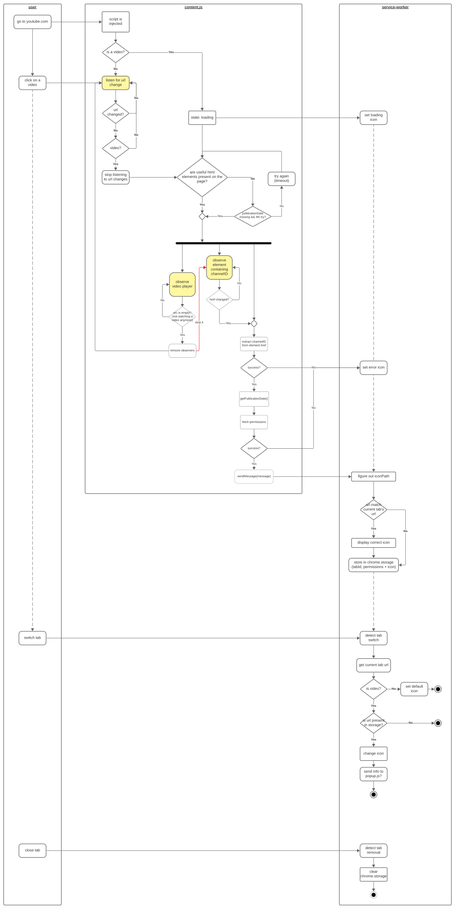

# yt-react-db web browser extension

This is code repository for [yt-react-db.com](https://yt-react-db.com) web browser extension.
Mainly tested on the "brave" web browser (which should be same behavior as google chrome).

The goal of this extension is to help reactors (live streamers, youtubers & editors)
know if they can react to a video when browsing it on youtube.

The idea behind the extension is that every time you watch a youtube video,
a small icon shows up, which is vertically split in 2 parts, left side to know
if you can react to the video live, and the right side to know if you can upload
your reaction.
If you click on the icon, it shows the permissions, and tell you how to read the
icon.
Each side can take one of 4 colors:

- green for yes
- red for no
- orange if there’s a delay and the delay hasn’t passed
- white if for some reason we are unable to tell!

So if the icon is fully green, you know you can react freely to the video!

- Problems or feature requests: [issue tracker](https://github.com/yt-react-db/issue-tracker/issues)
- [Discussions](https://github.com/yt-react-db/issue-tracker/discussions)
- or use [twitter](https://twitter.com/ComputerBread)

## Firefox

Ok, Firefox doesn't really fully implement manifest v3, so we need to replace the
content of manifest.json by manifest-firefox.json

## Report an issue

If you find a problem, please open a github issue at <https://github.com/yt-react-db/issue-tracker/issues>, with the given information:

- extension version
- web browser & its version used
- how to reproduce the bug
- (optional) screenshot or a link to a video showing the problem

## How it works

The following diagram (which is bad) gives an idea on how the extension works.

